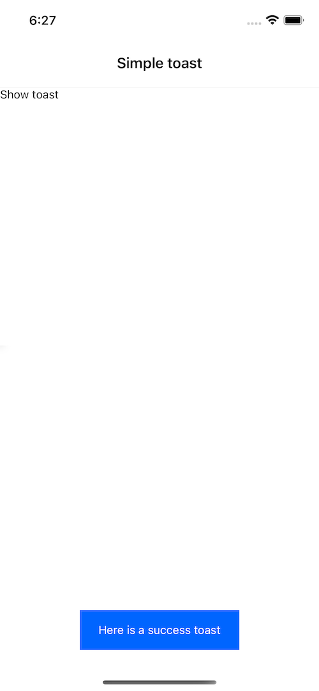
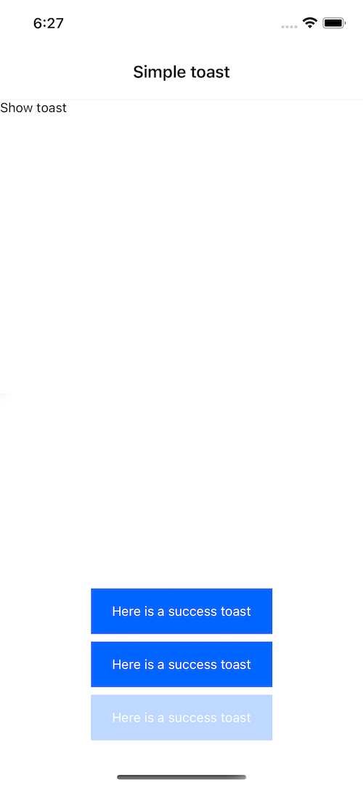

# React native simple toast message

This is a React Native component that displays a toast message on the screen. It provides two types of toasts: success and error, which are customizable through the provided ToastConfig object.

## Demo

Simple success toast


In case multiple toasts are shown, they are stacked on top of each other


## Installation

To use this component, install it as an npm package:

```bash
npm install --save react-native-toast-message
```

or

```bash
yarn add react-native-toast-message
```

## Usage

Import the **`Provider`** component from the package and wrap it around your main component:

```jsx
import Toast from "react-native-toast-message";

const App = () => {
  return (
    <View>
      {/* Your main component */}
      <Toast.Provider />
    </View>
  );
};
```

This creates a toast provider that can be used to show toast messages. To show a toast message, simply call the showSuccess or showError method of the **`Toast`** object:

```jsx
import Toast from "react-native-toast-message";

const ExampleComponent = () => {
  const handleButtonClick = () => {
    Toast.showSuccess("Success message");
    Toast.showError("Error message");
  };

  return (
    <View>
      <Button title="Show Toast" onPress={handleButtonClick} />
    </View>
  );
};
```

By default, the component will be displayed at the bottom of the screen, above the keyboard (if visible). You can customize the appearance of the toast by passing a **`ToastConfig`** object to the Provider component:

```jsx
import Toast from "react-native-toast-message";

const config = {
  successStyle: {
    backgroundColor: "#00FF00",
  },
  errorStyle: {
    backgroundColor: "#FF0000",
  },
  textStyle: {
    color: "#FFFFFF",
  },
};

const App = () => {
  return (
    <View>
      {/* Your main component */}
      <Toast.Provider config={config} />
    </View>
  );
};
```

# API

## Provider

The **`Provider`** component is used to display toast messages. It has the following props:

**`config?: ToastConfig`**: An optional object containing the configuration options for the toasts. See the ToastConfig type for more information.

## showSuccess

Static method that displays a success toast message.

**`message: string`**: The message to be displayed in the toast.

## showError

Static method that displays an error toast message.

**`message: string`**: The message to be displayed in the toast.

# Types

## ToastConfig

An object containing the configuration options for the toast messages. It has the following properties:

**`successStyle?: ViewStyle`**: An optional object containing the style properties for success toasts.
**`errorStyle?: ViewStyle`**: An optional object containing the style properties for error toasts.
**`textStyle?: ViewStyle`**: An optional object containing the style properties for the text in the toasts.

## ToastType

A type that represents the type of toast message. It can be either `"success"` or `"error"`.
